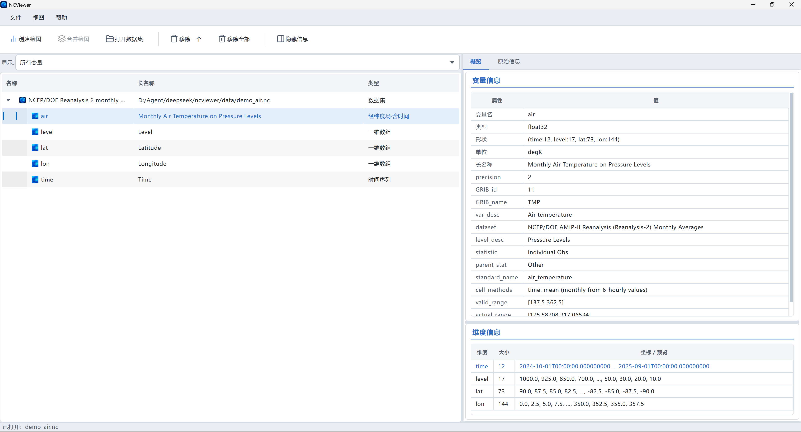
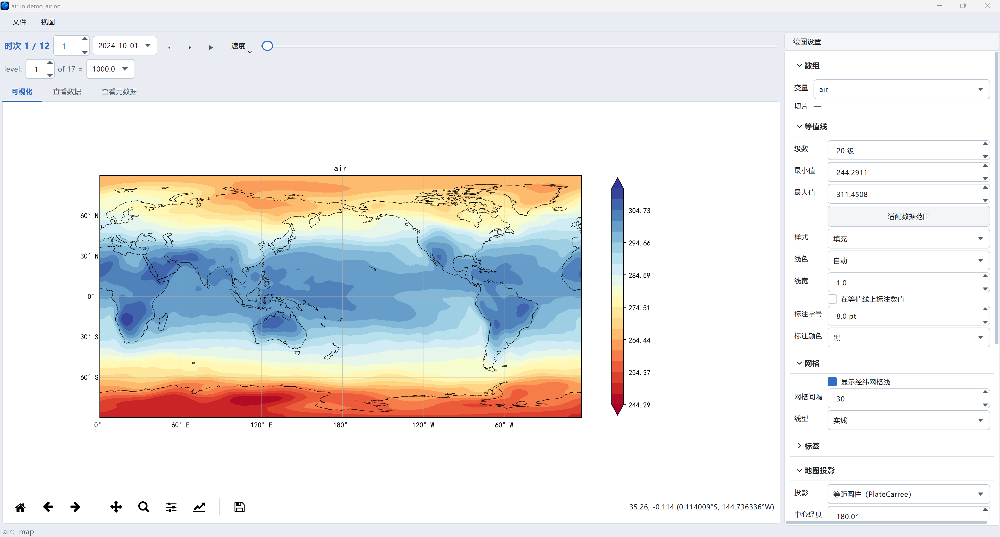
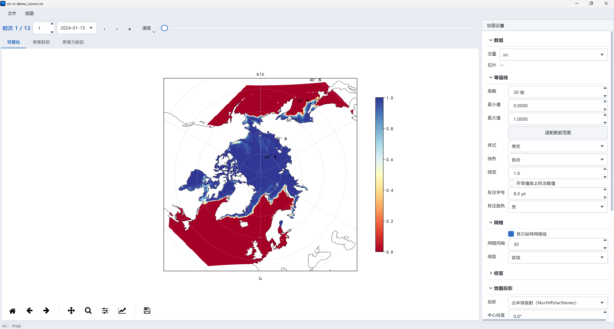
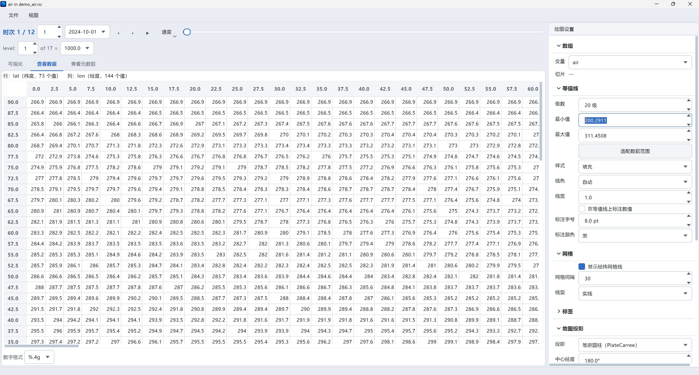
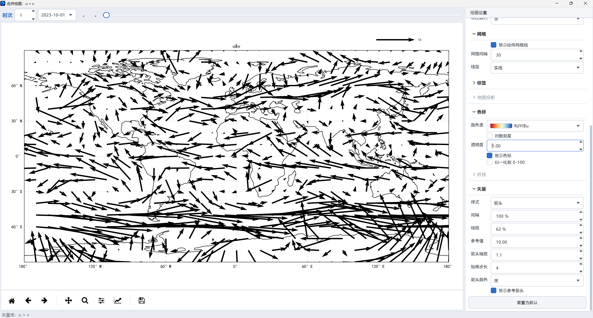

<p align="center">
  
</p>

<h1 align="center">🌍 NCViewer</h1>

<p align="center">
  <b>NetCDF 数据查看与绘图，三秒上手</b><br>
  无需代码 · 无需安装 · 打开即用
</p>

<p align="center">
  <a href="#"></a>
  <a href="#"></a>
  <a href="#"></a>
  <a href="#"></a>
  <a href="#"></a>
  <a href="#"></a>
</p>

<p align="center">
  一个中文界面的 NetCDF 数据可视化桌面工具。打开 `.nc` 文件 → 看元数据 → 画地图 → 导出论文级 PNG。
</p>

---

## ✨ 特性一览

| | 特性 | 说明 |
|---|---|---|
| 🚀 | **免安装** | 下载解压，双击即用，无需 Python / conda / 任何依赖 |
| 🗺️ | **开箱即画** | 地图 / 等值线 / 折线 / Hovmöller 剖面 / 矢量箭头，双击变量自动出图 |
| 🧭 | **智能投影** | 极区数据自动切换极地投影；投影下拉带中文说明 |
| 🎨 | **专业配色** | 32 种配色实时预览，支持对数刻度 / 归一化 / 透明 |
| 🧩 | **兼容各种网格** | 常规经纬度 · 旋转极网格 · CF 投影坐标（WRF / EASE-Grid）· 2D 辅助坐标 |
| 🌊 | **u/v 矢量场** | 选中 `u` + `v` 分量自动画矢量箭头图，箭头样式 / 密集度 / 粗细全可调 |
| 📊 | **元数据面板** | 变量信息 / 时间维 / 空间维 / 原始 CDL 一览无余 |
| ⏱️ | **时间浏览** | 滑块 / 步进 / 序号输入 / 动画播放，快速切换时次 |
| 📸 | **论文级导出** | 一键导出 PNG / CSV / 动画 GIF，直接进论文 |
| 🌐 | **离线可用** | 海岸线数据已内置，无需联网下载 |

---

## 📸 界面预览

<p align="center">
  
</p>
<p align="center"><em>主窗口：左侧数据树（数据集 → 变量，三列 名称｜长名称｜类型）+ 右侧元数据面板（变量信息 / 维度信息）</em></p>

<p align="center">
  
  
</p>
<p align="center"><em>左：绘图窗口（全球气温地图 + 时间控制 + 绘图设置）　右：北极海冰图（自动切换北半球极射投影）</em></p>

<p align="center">
  
  
</p>
<p align="center"><em>左：查看数据标签页（纬度 × 经度数值表格）　右：合并绘图 u + v 矢量箭头图</em></p>

---

## 🚀 快速开始

> **只需三步：下载 → 解压 → 双击打开**

1. **下载**：从 [Releases](../../releases) 页面获取 `NCViewer-windows-x64.zip`
2. **解压**：右键"全部解压"到任意文件夹（如 `D:\NCViewer`）
3. **运行**：双击 `NCViewer.exe`，即可开始探索数据

**第一次用**：点左上角「打开」（或 `Ctrl+O` / 直接把 `.nc` 拖进窗口），试试自带的示例数据 `data\demo_air.nc`（全球月平均气温）。

---

## 📖 使用教程

> 主窗口负责"打开 + 浏览"，绘图窗口负责"调参 + 出图"。先打开示例数据 `demo_air.nc`（全球月平均气温，自带）跟着走一遍最快。

### 1️⃣ 打开数据

打开 NetCDF 文件有三种方式，任选其一：

| 方式 | 操作 |
|---|---|
| 工具栏 | 点左上角「打开数据集」按钮 |
| 快捷键 | `Ctrl+O`，选择 `.nc` / `.nc4` 文件 |
| 拖拽 | 直接把 `.nc` 文件拖进窗口（支持一次拖多个） |

- **多个数据集**：可以连续打开多个文件，它们会并排显示在左侧树里，互不干扰。
- **显示过滤器**：树顶部「显示:」下拉可选「所有变量 / 可绘图变量」，后者会隐藏纯坐标变量。
- **最近打开**：菜单「文件 → 最近打开」可快速回到常用文件（记住最近 8 个）。

<p align="center">
  
</p>
<p align="center"><em>主窗口：左侧数据树 + 右侧元数据面板（变量信息 / 维度信息）</em></p>

### 2️⃣ 浏览数据

左侧树是两级结构：**数据集 → 变量**，三列分别是**名称 | 长名称 | 类型**。

- 点选**数据集**：右侧显示数据集信息（变量列表、全局属性）。
- 点选**变量**：右侧显示该变量的完整信息——
  - **变量信息**：变量名、类型（float32…）、形状 `(time, level, lat, lon)`、单位、长名称、全部属性；
  - **时间维度**：时次数、起止范围、日历、单位；
  - **空间维度**：纬度 / 经度 / 气压层的坐标值预览（首尾各几个，像 xarray 的 `print` 输出）。
- 切到 **「原始信息」** 标签页：显示完整 CDL 元数据（`netcdf file {...}` 语法，等宽字体），Panoply 同款。
- 树里「类型」列是自动识别的：经纬度场 · 含时间 / 时间序列 / 一维数组 / 二维平面 / 三维场 / 曲线网格经纬度场。

### 3️⃣ 创建绘图

**双击任意变量**，即可打开绘图窗口（等价于选中变量后点工具栏「创建绘图」）。

NCViewer 会根据数据形状**自动选择最佳图型**：

| 数据结构 | 自动图型 |
|---|---|
| 经纬度场（lat + lon） | 地图（等值线填充） |
| 只有时间的一维数据 | 折线图 |
| time × lat（无经度） | Hovmöller 剖面图 |
| 旋转极网格 / 2D 辅助坐标 | 曲线网格地图 |
| WRF / EASE-Grid 投影坐标（含 crs 变量） | 投影坐标地图 |
| 极区数据（全在 60°N 以北 / 60°S 以南） | **自动切换极地投影** |

<p align="center">
  
</p>
<p align="center"><em>绘图窗口：全球气温地图（等距圆柱投影）+ 时间控制条 + level 切片器 + 右侧绘图设置面板</em></p>

北极海冰数据（EASE-Grid 投影坐标 + 全北极范围）打开后自动识别为北半球极射投影：

<p align="center">
  
</p>
<p align="center"><em>北极海冰密集度：自动切换 NorthPolarStereo 极射投影</em></p>

### 4️⃣ 时间控制（绘图窗口顶部）

带时间维的变量，窗口顶部有一条完整的时间控制条（Panoply 同款）：

```
时次: [1] [2024-10-01 ▾]  ◀ ▶  ▶(播放)  [速度]  ────────●──── 滑块
```

| 控件 | 作用 |
|---|---|
| 时次序号框 | 直接输入数字跳到指定时次 |
| 日期下拉 | 显示真实时间字符串，点开选日期 |
| `◀` `▶` 按钮 | 上 / 下一时次 |
| `▶` 播放按钮 | 自动循环播放动画（配合右侧「速度」菜单 0.5×~4×） |
| 滑块 | 拖动快速浏览 |

**额外维度**：如果变量还有 `level` / `pressure` 等其它维度（非时间/经纬度），时间条下方会为每个维度生成一行切片器（序号 + 值下拉联动），Panoply 式逐维选择（如上图 `level: 1 of 17 = 1000.0`）。

### 5️⃣ 绘图设置（右侧面板）

绘图窗口右侧「绘图设置」面板是全部可调参数的入口，按功能折叠分组，改完**即时生效**：

| 分组 | 可设置项 |
|---|---|
| **数组** | 切换变量、当前切片信息 |
| **等值线** | 级数（5–50）、最小值 / 最大值、**适配数据范围**一键按钮、样式（填充 / 线 / 填充+线）、线色、线宽、等值线上标注数值、标注字号 / 颜色 |
| **网格** | 显示经纬网格线开关、网格间隔、线型（实线 / 虚线 / 点线） |
| **标签** | 标题、副标题、X / Y 轴标签、脚注（左 / 中 / 右）、三级字号、图上标注数据 min-max |
| **地图投影** | 6 种投影（带中文说明：等距圆柱 / 罗宾逊 / 摩尔魏特 / 兰勃特等角圆锥 / 北半球极射 / 墨卡托）、中心经度 / 纬度、**经度 / 纬度范围**（框选区域）、重置为全球范围 |
| **色标** | 32 种颜色表（下拉带**渐变预览条**）、对数刻度、透明度、显示色标开关、归一化到 0–100 |
| **折线** | 线型（实线 / 虚线 / 点划线 / 点线）——仅折线图可用 |
| **矢量** | 箭头样式（箭头 / 上游点 / 不画）、间隔（密集度 25–250%）、线粗（25–400%）、参考值（箭头大小基准）、箭头缩放、抽稀步长、箭头颜色、显示参考箭头——仅矢量场可用 |
| （底部） | **重置为默认**按钮 |

> 用不上的分组会自动**折叠置灰**（比如折线图时投影分组不可用），界面不会堆满无效选项。

### 6️⃣ 三视图（绘图窗口标签页）

绘图窗口上部有三个标签页：

| 标签页 | 内容 |
|---|---|
| **可视化** | 地图 / 折线 / 剖面图 + matplotlib 工具栏（缩放、平移、保存图像） |
| **查看数据** | 当前时次的**数据表格**（行 = 纬度，列 = 经度，带真实坐标表头）；底部「数字格式」下拉可调小数位数 |
| **查看元数据** | 该变量的 CDL 元数据 |

<p align="center">
  
</p>
<p align="center"><em>查看数据：lat × lon 数值表格，行列带真实坐标</em></p>

### 7️⃣ 合并绘图与矢量场

- **多图拼版**：在树中按住 `Ctrl`（或 `Shift`）**多选多个变量**，点工具栏「合并绘图」，它们会在同一窗口以子图网格显示，共享一个时间滑块。
- **u/v 矢量场**：选中 `u` + `v`（或 `U`/`V`、`x_wind`/`y_wind` 等 9 组常见命名）两个分量后点「合并绘图」，会自动画成**矢量箭头图**（极区数据自动极地投影），右侧「矢量」分组可调箭头样式 / 密集度 / 粗细 / 参考箭头：

<p align="center">
  
</p>
<p align="center"><em>合并绘图 u + v：全球风场矢量箭头图（含参考箭头 u&v 10）</em></p>

### 8️⃣ 导出

绘图窗口菜单「文件」下有三种导出：

| 菜单项 | 快捷键 | 导出内容 |
|---|---|---|
| 导出图像 | `Ctrl+S` | 当前图为 **PNG（150 dpi）**，可直接进论文 |
| 导出数据 CSV | — | 当前变量的全维度数据表（含坐标列） |
| 导出动画 GIF | — | 逐时次渲染并合成**循环动画** |

### 9️⃣ 快捷键速查

| 快捷键 | 功能 |
|---|---|
| `Ctrl+O` | 打开数据集 |
| `Ctrl+Q` | 退出 |
| `Ctrl+S` | 导出当前图像 |
| 双击变量 | 创建绘图 |
| `Ctrl` / `Shift` + 点选 | 多选变量（合并绘图） |

---

## ❓ 常见问题

**Q: 双击没反应 / 被杀软拦截？**
首次运行 Windows 可能提示"未知发布者"→ 点「更多信息」→「仍要运行」。若杀软误报，加入白名单即可（未签名程序的正常现象，程序本身安全）。

**Q: 提示"无法识别经纬度维度"？**
该数据坐标维不叫 lat/lon。支持常见命名和 CF 标准，极特殊网格（如非结构网格）暂不支持。

**Q: 能打开 GRIB / HDF 吗？**
目前支持 NetCDF（`.nc` / `.nc4`）。GRIB 请先转成 NetCDF。

---

## 🔧 开发者版

```bash
conda create -n ncviewer python=3.11 -y && conda activate ncviewer
pip install PySide6 xarray netCDF4 matplotlib cartopy cftime numpy pandas
python app.py
```

**测试**：`tests/` 下 11 个测试文件，全部通过为正常。

**结构**：`core/` 数据层 · `plots/` 渲染层 · `ui/` 界面层 · `data/` 示例数据与内置海岸线

---

## 🗺️ 支持的坐标系统

- ✅ 常规 1D 经纬度网格（lat/lon）
- ✅ 2D 辅助经纬度坐标（curvilinear grid，旋转极网格 / 模式输出）
- ✅ CF 投影坐标网格（grid_mapping，WRF / NSIDC 海冰 EASE-Grid）
- ✅ 自动识别极区数据并切换极地投影

## 📄 License

MIT · 海岸线数据 © [Natural Earth](https://www.naturalearthdata.com/)（公有领域）
