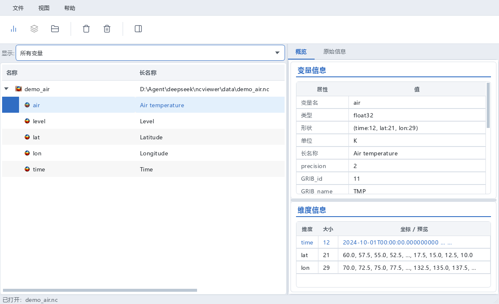
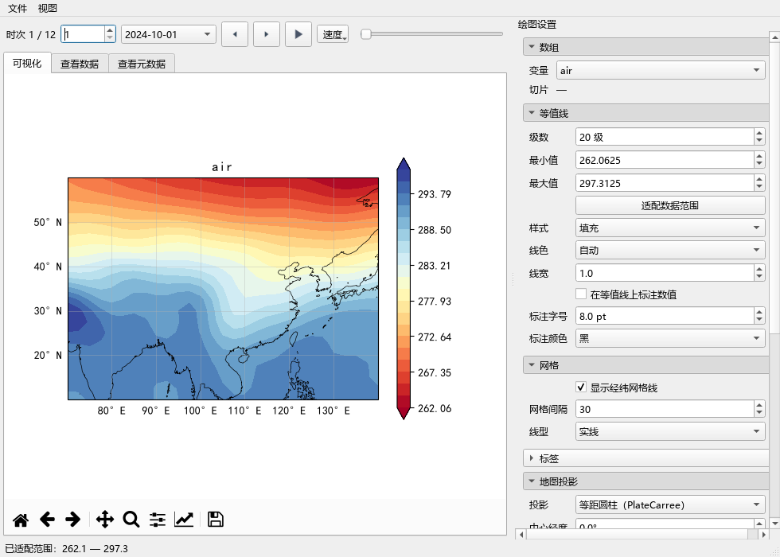

<p align="center">
  
</p>

<h1 align="center">🌍 NCViewer</h1>

<p align="center">
  <b>NetCDF 数据查看与绘图，三秒上手</b><br>
  无需代码 · 无需安装 · 打开即用
</p>

<p align="center">
  <a href="#"></a>
  <a href="#"></a>
  <a href="#"></a>
  <a href="#"></a>
  <a href="#"></a>
  <a href="#"></a>
</p>

<p align="center">
  一个中文界面的 NetCDF 数据可视化桌面工具。打开 `.nc` 文件 → 看元数据 → 画地图 → 导出论文级 PNG。
</p>

---

## ✨ 特性一览

| | 特性 | 说明 |
|---|---|---|
| 🚀 | **免安装** | 下载解压，双击即用，无需 Python / conda / 任何依赖 |
| 🗺️ | **开箱即画** | 地图 / 等值线 / 折线 / Hovmöller 剖面 / 矢量箭头，双击变量自动出图 |
| 🧭 | **智能投影** | 极区数据自动切换极地投影；投影下拉带中文说明 |
| 🎨 | **专业配色** | 32 种配色实时预览，支持对数刻度 / 归一化 / 透明 |
| 🧩 | **兼容各种网格** | 常规经纬度 · 旋转极网格 · CF 投影坐标（WRF / EASE-Grid）· 2D 辅助坐标 |
| 🌊 | **u/v 矢量场** | 选中 `u` + `v` 分量自动画矢量箭头图 |
| 📊 | **元数据面板** | 变量信息 / 时间维 / 空间维 / 原始 CDL 一览无余 |
| ⏱️ | **时间浏览** | 滑块 / 步进 / 序号输入，快速切换时次 |
| 📸 | **论文级导出** | 一键导出 PNG，直接进论文 |
| 🌐 | **离线可用** | 海岸线数据已内置，无需联网下载 |

---

## 📸 界面预览

<p align="center">
  
  
</p>
<p align="center">
  <em>左：主窗口（数据树 + 元数据面板）　右：绘图窗口（全球气温地图 + 时间控制）</em>
</p>

---

## 🚀 快速开始

> **只需三步：下载 → 解压 → 双击打开**

1. **下载**：从 [Releases](../../releases) 页面获取 `NCViewer-windows-x64.zip`
2. **解压**：右键"全部解压"到任意文件夹（如 `D:\NCViewer`）
3. **运行**：双击 `NCViewer.exe`，即可开始探索数据

**第一次用**：点左上角「打开」（或 `Ctrl+O` / 直接把 `.nc` 拖进窗口），试试自带的示例数据 `data\demo_air.nc`（全球月平均气温）。

---

## 📖 使用小贴士

| 操作 | 效果 |
|---|---|
| 左侧树点选变量 | 右侧显示变量信息（维度、单位、范围） |
| **双击变量** | 打开绘图窗口，自动选择最佳图型 |
| 底部时间条 | 拖滑块 / 点 ◀ ▶ / 输序号切换时次 |
| 右侧「绘图设置」 | 投影 / 配色 / 等值线 / 标题，即时生效 |
| `Ctrl` 多选 + 合并绘图 | 多图拼版；`u`+`v` 自动矢量箭头 |
| 文件 → 导出图像 | 保存 PNG，可直接放进论文 |

---

## ❓ 常见问题

**Q: 双击没反应 / 被杀软拦截？**
首次运行 Windows 可能提示"未知发布者"→ 点「更多信息」→「仍要运行」。若杀软误报，加入白名单即可（未签名程序的正常现象，程序本身安全）。

**Q: 提示"无法识别经纬度维度"？**
该数据坐标维不叫 lat/lon。支持常见命名和 CF 标准，极特殊网格（如非结构网格）暂不支持。

**Q: 能打开 GRIB / HDF 吗？**
目前支持 NetCDF（`.nc` / `.nc4`）。GRIB 请先转成 NetCDF。

---

## 🔧 开发者版

```bash
conda create -n ncviewer python=3.11 -y && conda activate ncviewer
pip install PySide6 xarray netCDF4 matplotlib cartopy cftime numpy pandas
python app.py
```

**测试**：`tests/` 下 11 个测试文件，全部通过为正常。

**结构**：`core/` 数据层 · `plots/` 渲染层 · `ui/` 界面层 · `data/` 示例数据与内置海岸线

---

## 🗺️ 支持的坐标系统

- ✅ 常规 1D 经纬度网格（lat/lon）
- ✅ 2D 辅助经纬度坐标（curvilinear grid，旋转极网格 / 模式输出）
- ✅ CF 投影坐标网格（grid_mapping，WRF / NSIDC 海冰 EASE-Grid）
- ✅ 自动识别极区数据并切换极地投影

## 📄 License

MIT · 海岸线数据 © [Natural Earth](https://www.naturalearthdata.com/)（公有领域）
